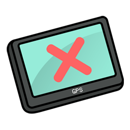
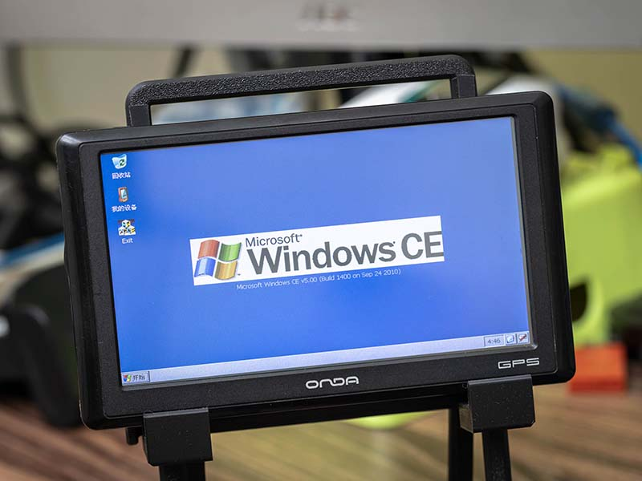

  

# Onda GPS Shell Killer

此项目旨在提供一个无依赖的小工具，用来关闭昂达VP80等机器的内置界面，并打开Windows CE的标准界面。

## 如何安装
将机器通过USB连接电脑，替换掉`NaviOne`目录下的`NaviOne.exe`，即可开机自动启动本程序，或者通过点击默认Shell的导航工具来启动。

## 如何使用
点击程序的 `Kill Shell` 按钮即可关闭默认Shell并且打开Explorer。

  

